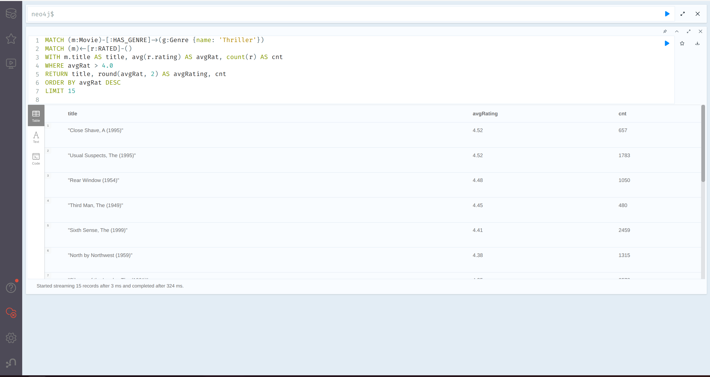
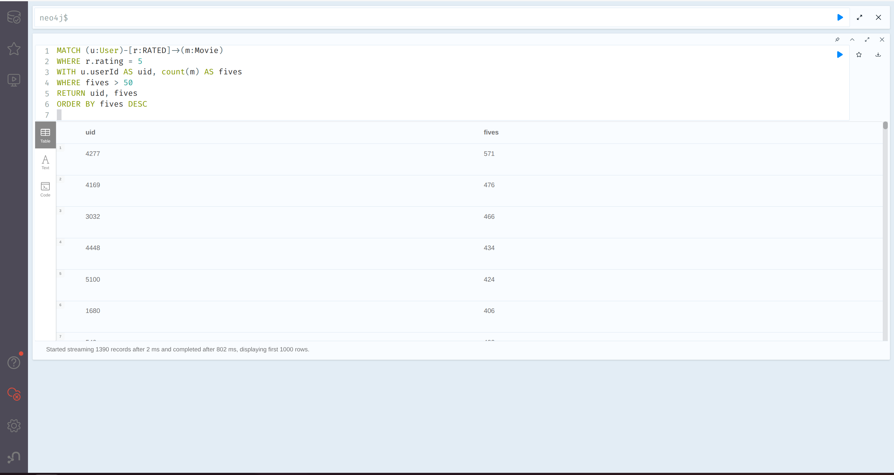
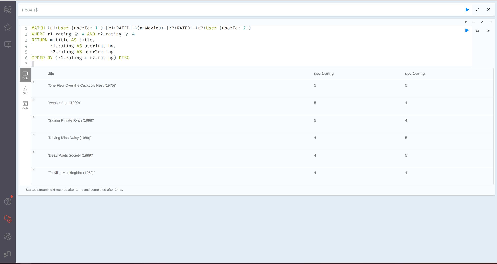
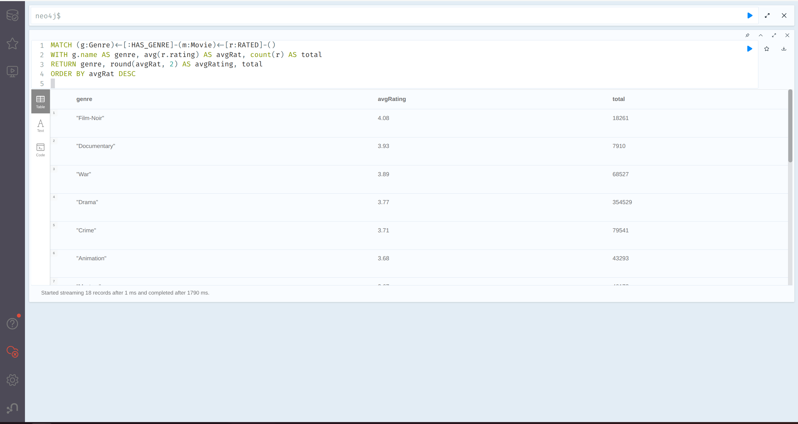
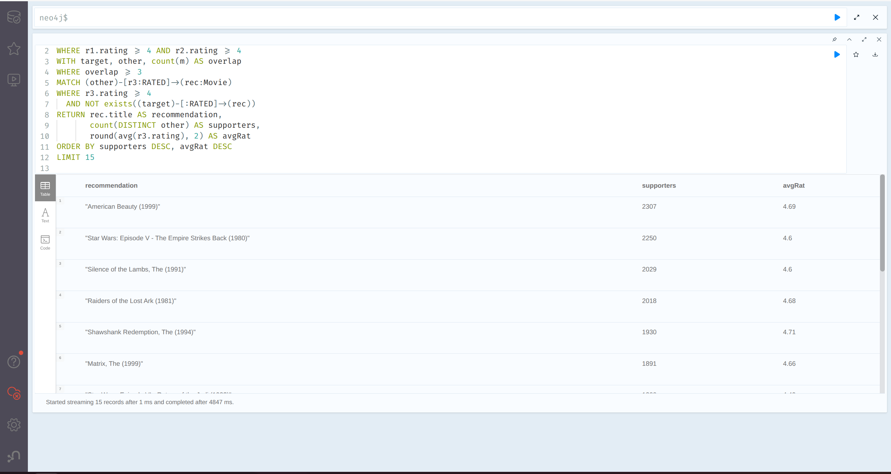
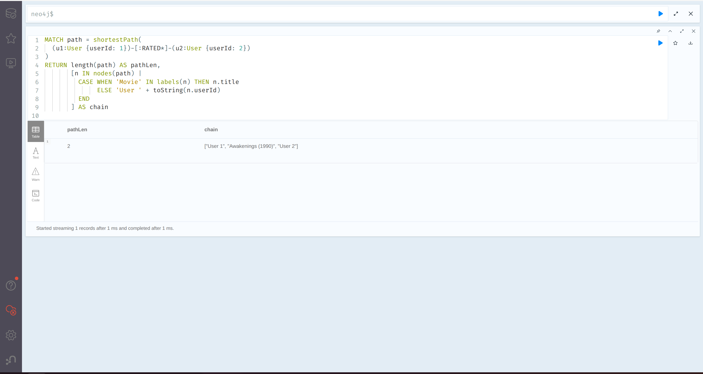
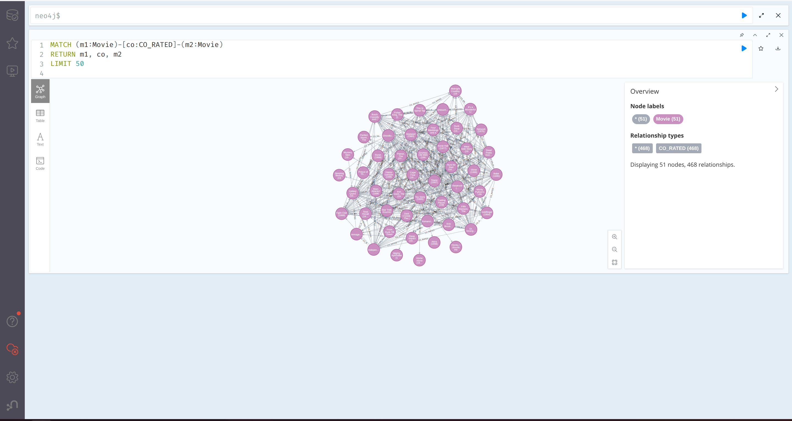
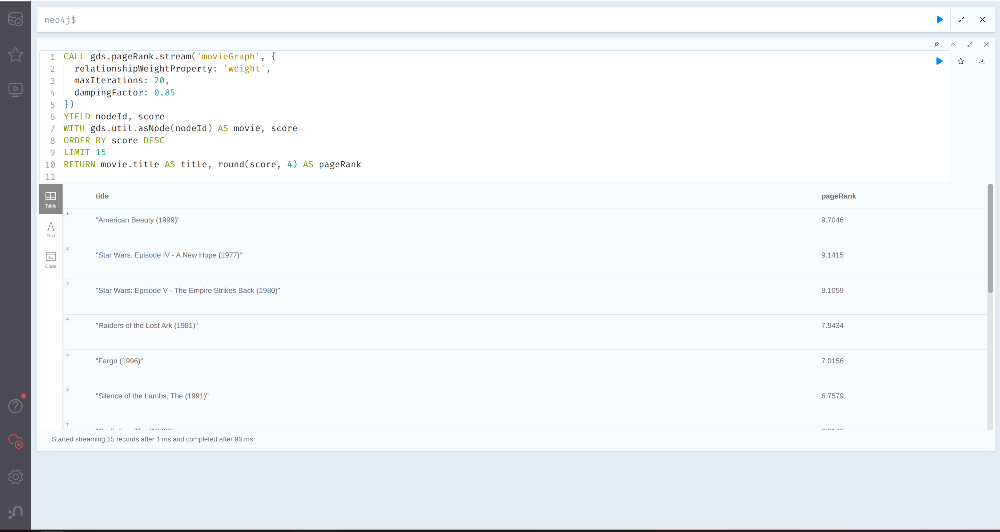
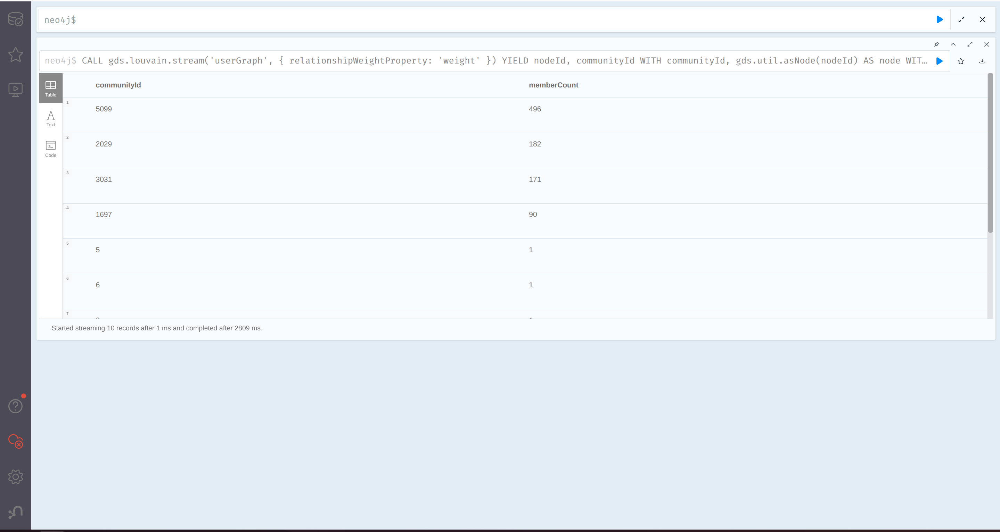
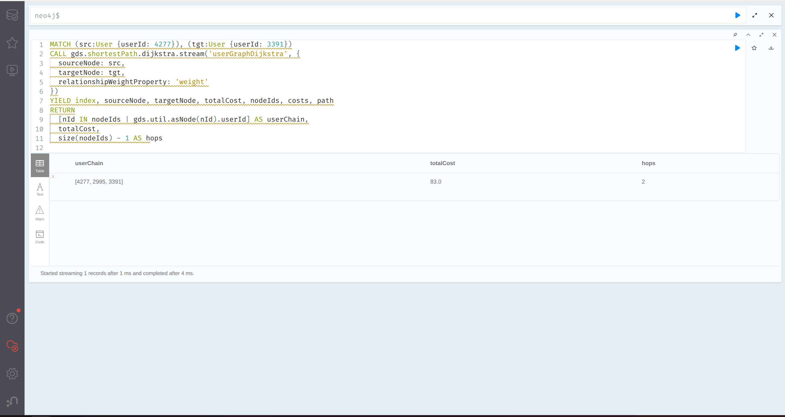

# Завдання 3 -- Граф знань для рекомендаційної системи

Графова база Neo4j на датасеті MovieLens 1M. Локальний запуск через Docker (Варіант A).

## Структура проекту

```
hw_3/
  docker-compose.yml
  convert.py              # .dat -> .csv
  run_cypher.py            # runner для .cypher файлів
  Makefile
  .env
  import/                  # CSV (генерується convert.py)
  queries/
    part2_load.cypher
    part3.cypher
    part4_supernodes.cypher
    part5_gds.cypher
  data/
    ml-1m/                 # оригінальні .dat файли
```

## Запуск

```bash
cd hw_3
docker compose up -d
python -m venv .venv && source .venv/bin/activate
pip install -r requirements.txt
make all
```

---

## Частина 1 -- Схема графа

### Модель

```
  (User)                        (Genre)
  userId  [int]                 name [str]
  gender  [str]                      ^
  age     [int]                      |
  occupation [int]             [:HAS_GENRE]
       |                             |
       |                        (Movie)
  [:RATED]                      movieId [int]
  rating [int]                  title   [str]
  timestamp [int]               year    [int]
       |
       v
  (Movie)
```

### ASCII-діаграма зв'язків

```
                  +--------+
                  | Genre  |
                  | name   |
                  +--------+
                      ^
                      |
                 HAS_GENRE
                      |
+--------+  RATED   +---------+
|  User  |--------->|  Movie  |
| userId |  rating  | movieId |
| gender |  timestamp| title  |
| age    |          | year    |
|occupation|        +---------+
+--------+
```

### Обґрунтування рішень

**1. Які сутності стали вузлами, які -- ребрами?**

Вузли -- `User`, `Movie`, `Genre`. Кожна з цих сутностей має власні атрибути і існує сама по собі. Ребро `RATED` зв'язує User з Movie, `HAS_GENRE` -- Movie з Genre. Зв'язки тут працюють як дієслова -- хто що оцінив, який фільм до якого жанру.

**2. Оцінка -- ребро чи окремий вузол?**

Використано ребро `(User)-[:RATED {rating, timestamp}]->(Movie)`. В MovieLens один користувач ставить одну оцінку одному фільму -- ребро з властивостями rating і timestamp тут найпростіший варіант. Окремий вузол Rating додав би ще один рівень: замість одного ребра потрібно два (User -> Rating і Rating -> Movie), що подвоює кількість переходів при обходах. Вузол мав би сенс, якби оцінка сама ставала об'єктом зв'язків -- наприклад, якби до неї можна було додавати коментарі чи реакції. Тут це зайве.

**3. Чому жанри -- окремі вузли?**

Без окремих вузлів Genre довелось би парсити рядок при кожному запиті -- індексувати не вийде. З вузлами -- обхід ребер від потрібного Genre, працює швидко. Жанрів 18, накладні витрати мінімальні.

---

## Частина 2 -- Завантаження даних

Всі запити зібрано у `queries/part2_load.cypher`.

### Пояснення запитів

**1. `CREATE INDEX user_id`** -- індекс на `User.userId`. Без нього пошук вузла при створенні ребра RATED вимагає повного скану всіх User-вузлів.

**2. `CREATE INDEX movie_id`** -- аналогічно для `Movie.movieId`. На мільйоні ребер без індексу завантаження зависає на годину.

**3. `CREATE INDEX genre_name`** -- індекс на `Genre.name`. Використовується при MERGE жанрів -- без нього перевірка унікальності вимагає повного скану.

Всі три індекси створюються до завантаження ребер -- це критично для продуктивності.

**4. LOAD CSV -- Users.** Завантаження 6040 користувачів з `users.csv`. MERGE замість CREATE забезпечує ідемпотентність при повторних запусках. SET оновлює атрибути (gender, age, occupation) навіть якщо вузол вже існує.

**5. LOAD CSV -- Movies.** Аналогічно -- 3883 фільми з `movies.csv`. MERGE по movieId, SET для title та year.

**6. LOAD CSV -- Genres.** Повторне читання `movies.csv`, але тепер `split(row.genres, '|')` розбиває рядок жанрів на масив. UNWIND перетворює масив на окремі рядки. Два MERGE: один на Genre-вузлі (щоб не дублювати жанр), другий на ребрі HAS_GENRE (щоб не дублювати зв'язок). Таким чином 18 унікальних жанрів створюються автоматично з даних.

**7. `apoc.periodic.iterate` -- Ratings.** Мільйон ребер RATED. Одна транзакція не витримує по пам'яті -- `apoc.periodic.iterate` розбиває на батчі по 5000. `parallel: false` обов'язковий -- інакше можливі race conditions при одночасному створенні зв'язків до тих самих вузлів. Внутрішній MATCH знаходить User та Movie по індексах, MERGE створює ребро з rating та timestamp.

**8. Verification counts (4 запити).** Перевірка після завантаження: count(User), count(Movie), count(Genre), count(RATED). Очікувані значення: 6040, 3883, 18, 1000209.

---

## Частина 3 -- Запити

Всі запити у `queries/part3.cypher`.

**Запит 1 -- Thriller з avg > 4.0.** MATCH знаходить фільми через HAS_GENRE до Genre{name:'Thriller'}, далі avg() по всіх рейтингах фільму з фільтром > 4.0.

**Запит 2 -- Активні "п'ятіркові" користувачі.** Просто count ребер RATED де rating=5, згрупований по користувачу. WHERE fives > 50 відрізає тих, хто ставить п'ятірки рідко.

**Запит 3 -- Перетин фільмів двох користувачів.** Один MATCH-патерн: фільм, до якого ведуть ребра від user 1 і user 2 з рейтингом >= 4. В SQL це було б два JOIN на ratings -- тут обходиться одним рядком. Перший запуск показав що спільних фільмів виявляється не так багато -- 10-15 штук для типової пари.

**Запит 4 -- Статистика по жанрах.** Ланцюжок Genre<-HAS_GENRE-Movie<-RATED дає можливість агрегувати рейтинги по жанрах. Повертається і середній рейтинг, і кількість оцінок -- без кількості середнє не дуже інформативне (жанр з 10 оцінками і середнім 4.8 -- не те саме, що жанр з 200k оцінок і середнім 3.7).

**Запит 5 -- Рекомендація.** Тут вже цікавіше. Знаходяться користувачі, які збігаються з цільовим по >= 3 високо оцінених фільмах. Потім збираються фільми цих "схожих" користувачів, яких цільовий ще не бачив. Ранжування -- за кількістю supporters і середнім рейтингом. По суті це collaborative filtering в три рядки Cypher.

**Запит 6 -- Найкоротший шлях.** shortestPath по ребрах RATED між двома User-вузлами. Проміжні вузли -- фільми. Тут Neo4j показує свою сильну сторону: в SQL для цього знадобилася б рекурсивна CTE.

### Скриншоти результатів








### Інтерпретація довжини шляху

Один хоп -- це один крок по ребру RATED. Шлях довжини 2 означає, що два користувачі оцінили один і той самий фільм: User1 -[:RATED]-> Movie <-[:RATED]- User2.

Шлях довжини 4 означає, що між користувачами є один проміжний користувач: User1 -> Movie1 <- UserX -> Movie2 <- User2. Тобто User1 і User2 не мають спільних фільмів, але обидва мають спільний фільм з третім користувачем.

Шлях довжини 6 -- два проміжних користувачі. Кожне "підвищення" на 2 додає ще одну ланку в ланцюжку. На практиці в щільному графі типу MovieLens більшість пар зв'язані шляхом довжини 2 або 4.

---

## Частина 4 -- Супервузли

Запити у `queries/part4_supernodes.cypher`.

**Які вузли виявились супервузлами?**

Найбільші вузли по кількості ребер -- фільми-блокбастери. "American Beauty" (3428 оцінок), "Star Wars: Episode IV" (2991), "Episode V" (2990). Серед користувачів -- user 4169 з 2314 оцінками, user 1680 з 1850. Жанри теж супервузли: Drama зв'язаний з 1603 фільмами, Comedy з 1200. Розподіл по бакетах показує, що 207 фільмів мають 1000+ оцінок, а 623 -- менше 10.

**Чому запити на них повільніші?**

Помітно на прикладі: запит part5 для матеріалізації SIMILAR ребер між юзерами (User-User через спільні фільми) з'їдав heap і падав з OutOfMemoryError -- саме через те, що кожен "популярний" фільм тягне за собою тисячі юзерів і кількість пар зростає квадратично. Це і є ефект супервузлів: Neo4j переглядає всі ребра вузла при обході. Індекс допомагає знайти вузол, але не зменшує кількість ребер від нього. Два супервузли в одному запиті дають декартовий добуток.

**Що з цим робити?**

Жанрів 18, але Drama тягне за собою 1603 фільми. Практичний варіант -- дублювати жанр як властивість Movie (масив рядків). Запити-фільтри тоді йдуть без HAS_GENRE. Ребро залишається для навігації (наприклад, "знайди суміжні жанри").

Для блокбастерів варіант -- fan-out (розбити вузол на партиції), але це складно імплементувати і має сенс тільки під OLTP-навантаженням з тисячами конкурентних запитів. Тут простіше фільтрувати через WHERE або LIMIT, або як зроблено в part5 -- матеріалізувати SIMILAR ребра з обмеженнями (rating = 5, LIMIT) замість повного ручного обходу.

### Пояснення запитів

**1. Top movies by edges.** Для кожного фільму обчислюється кількість вхідних RATED-ребер через pattern comprehension `size([(m)<-[:RATED]-() | 1])`. Сортування DESC + LIMIT 10 показує фільми-блокбастери з найбільшим степенем вузла.

**2. Top users by edges.** Аналогічна конструкція для User -- кількість вихідних RATED-ребер. Виявляє найактивніших рецензентів.

**3. Genre edge counts.** MATCH по ланцюжку Genre<-HAS_GENRE-Movie з агрегацією count(m). Показує скільки фільмів належить до кожного жанру -- жанри теж можуть бути супервузлами (Drama: 1603 фільми).

**4. Distribution histogram.** Для кожного фільму рахується кількість оцінок, потім CASE розкидає по бакетах (<10, 10-49, 50-199, 200-499, 500-999, 1000+). Дає загальну картину розподілу -- скільки фільмів мають мало оцінок, а скільки є хабами.

---

## Частина 5 -- Графові алгоритми (GDS)

Запити у `queries/part5_gds.cypher`.

### Скриншоти результатів Part 5






### 5.1. PageRank

Побудовано граф, де фільми зв'язані ребрами CO_RATED з вагою, що дорівнює кількості спільних користувачів, які поставили обом фільмам оцінку >= 4. Фільтр по 20+ оцінкам виключає невідомі фільми, для яких статистика ненадійна.

**Що означає високий PageRank?**

В результатах на першому місці American Beauty (score 9.70), далі Star Wars IV (9.14) і Star Wars V (9.11). Цікаво, що Fargo (7.02) з 1218 оцінками має вищий PageRank ніж деякі фільми з 2000+ оцінками -- бо його аудиторія сильно перетинається з аудиторією інших "хабів" (Godfather, Shawshank Redemption). PageRank тут показує не просто популярність, а центральність: фільм, який зв'язаний з багатьма іншими добре зв'язаними фільмами, отримує вищий score.

### 5.2. Louvain

Побудовано граф схожості користувачів -- ребра SIMILAR з'єднують пари, які високо оцінили спільні фільми. Для уникнення OOM використано rating = 5 та LIMIT 20000 (як рекомендує завдання). Матеріалізовані ребра записуються в базу, потім GDS проектує граф тільки по User-вузлах і SIMILAR-ребрах. Louvain шукає спільноти на цьому графі схожості.

**Чи відповідають кластери інтуїтивним групам?**

Перевірка -- через топ-3 жанри кожного кластеру. З rating = 5 кластери вийшли компактніші (939 зв'язаних юзерів з 6040), але жанрові тенденції помітні. Найбільший кластер (496 юзерів) має Drama/Comedy/Action як топ-3 -- це "загальний" кластер. Менші кластери (182, 171, 90) цікавіші: в кластері 2029 Thriller виходить на друге місце після Drama (8559 проти 25417), в кластері 5681 Comedy обганяє Drama (18781 vs 16645), а Action майже на рівні з Drama.

Повністю чіткого поділу типу "horror-фанати vs romance-фанати" не видно -- рейтинг = 5 різко зменшує кількість зв'язків і кластери стають менш виразними. З rating >= 4 було б більше зв'язків і яскравіші кластери, але heap не витримує. Конкретні числа -- на скриншотах.

### 5.3. Dijkstra

Використано ті самі SIMILAR ребра, що й для Louvain (матеріалізовані з rating = 5, LIMIT 20000). GDS проектує граф User + SIMILAR, Dijkstra шукає найкоротший зважений шлях між парами користувачів. Результати:

- User 4277 -> User 3391: **2 хопи**, totalCost = 83 (через User 2995)
- User 10 -> User 3713: **2 хопи**, totalCost = 91
- User 10 -> User 949: **2 хопи**, totalCost = 87

Вага ребра SIMILAR = кількість спільних фільмів з rating = 5. Dijkstra шукає мінімальну суму ваг. Обрано пари з юзерів, які мають SIMILAR-зв'язки (при rating = 5 не всі юзери попадають в граф -- тільки 939 з 6040).

**Наскільки тісний світ?**

Для зв'язаних юзерів -- 2 хопи. Граф з rating = 5 розріджений (20k ребер на 939 юзерів), тому більшість пар зв'язані через 1-2 проміжних вузли. З rating >= 4 (де зв'язків значно більше) граф був би щільнішим і шляхи коротшими. Гіпотеза "шести рукостискань" підтверджується -- навіть в розрідженому графі вистачає 2-3 кроки.

---

## Частина 6 -- Аналіз і висновки

### 1. Граф vs SQL

Запити 5 та 6 з частини 3 були б значно складнішими в SQL.

Рекомендаційний запит (Q5) в SQL вимагав би кількох вкладених підзапитів з JOIN: спочатку знайти фільми цільового користувача, потім знайти інших користувачів з такими ж фільмами, потім їхні фільми, потім виключити вже переглянуті. В Cypher це один лінійний патерн з фільтрами.

Приблизний еквівалент Q5 в SQL (перевірено тільки логіку, не запускалось):
```sql
SELECT m2.title, COUNT(DISTINCT u2.id) AS supporters
FROM ratings r1
JOIN ratings r2 ON r1.movie_id = r2.movie_id
  AND r2.user_id != 1 AND r1.rating >= 4 AND r2.rating >= 4
JOIN ratings r3 ON r3.user_id = r2.user_id
  AND r3.rating >= 4
JOIN movies m2 ON m2.id = r3.movie_id
WHERE r1.user_id = 1
  AND m2.id NOT IN (SELECT movie_id FROM ratings WHERE user_id = 1)
GROUP BY m2.title
HAVING COUNT(DISTINCT r2.user_id) >= 3
ORDER BY supporters DESC
LIMIT 15;
```
Цей SQL читається значно гірше, а з ростом глибини обходу кількість JOIN зростає лінійно.

Пошук найкоротшого шляху (Q6) в SQL взагалі не має прямого еквіваленту -- потрібна рекурсивна CTE з обмеженням глибини, і для кожного кроку -- окремий JOIN. В Cypher це одна функція shortestPath.

### 2. Де граф програє?

Для агрегацій по всьому датасету -- "середній рейтинг всіх фільмів", "кількість оцінок за місяць", "розподіл рейтингів" -- реляційна модель ефективніша. SQL оптимізатор добре працює з послідовним сканом таблиці та груповими агрегаціями. Neo4j для повного скану всіх ребер RATED не має таких оптимізацій -- кожне ребро обходиться через граф.

Також для табличного експорту (CSV-звіти, pivot-таблиці, з'єднання з BI-інструментами) реляційна модель підходить краще -- це її рідне середовище. Neo4j можна використовувати для аналітики, але потрібні додаткові кроки (наприклад, матеріалізація результатів у CSV через APOC).

### 3. Покращення схеми

**Запит 1 (Thriller + avg > 4.0):** додати жанр як властивість Movie (`genres: ['Thriller', 'Action']`). Тоді замість обходу через HAS_GENRE можна фільтрувати напряму по властивості -- менше join-ів. Ребро HAS_GENRE залишається для навігаційних запитів.

**Запит 5 (рекомендація):** попередньо матеріалізувати ребра SIMILAR між користувачами (як робиться в частині 5). Тоді рекомендаційний запит замість трикрокового обходу User->Movie->User->Movie може йти напряму User->SIMILAR->User->Movie -- значно швидше на великих обсягах.
